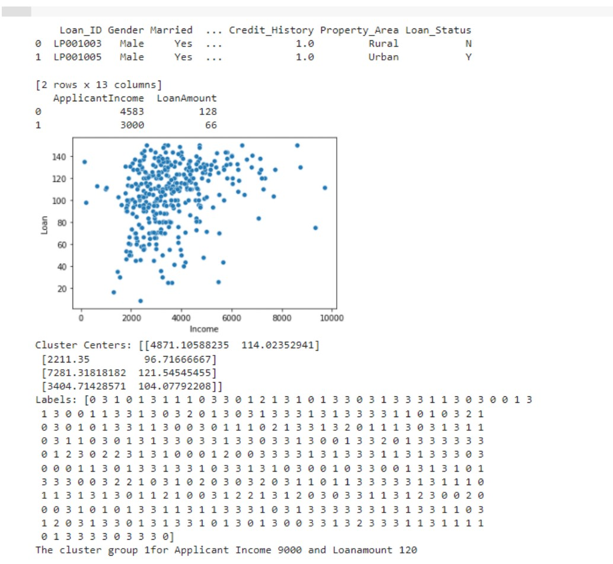

# Implementation of K-Means Clustering Algorithm
## Aim
To write a python program to implement K-Means Clustering Algorithm.

## Equipment’s required:
Hardware – PCs Anaconda – Python 3.7 Installation

## Algorithm:
## Step1:
Import pandas.

## Step2:
Import matplotlib.pyplot.

## Step3:
Import sklearn.cluster from KMeans module.

## Step4:
Import seaborn

## Step5:
Import warnings

## Step6:
Declare warnings.filerwarning with ignore as argument

Step7:
Declare a variable x1 and read a csv file(clustering.xlr) in it.

## Step8:
Declare a variable x2 as index of x1 with arguments ApplicantIncome and LoanAmount.

## Step9:
Display x1.head(2) and x2.head(2).

## Step10:
Declare a variable x and store x2.values.

## Step11:
Declare sns.scatterplot for ApplicantIncome and LoanAmount by indexing.

## Step12:
Plot Income , Loan and display them.

## Step13:
Declare a variable kmean = KMean(n_cluster_centers_) and execute kmean.fit(x).

## Step14:
Display kmean.cluster)centers

## Step15:
Display kmean.labels_

## Step16:
Declare a variable predcited_class to kmean.predict([[]]) and give two arguments in it.

## Step17:
Display the predicted_class

## Program:
```
import pandas as pd
from sklearn.cluster import KMeans 
import matplotlib.pyplot as plt
import seaborn as sns 
x1 = pd.read_csv('clustering.csv') 
print (x1.head (2)) 
x2 = x1.loc[:,['ApplicantIncome', 'LoanAmount']] 
print(x2.head (2))

x=x2.values
#print(x)
sns.scatterplot (x[:,0],x[:,1])
plt.xlabel('Income')
plt.ylabel('Loan')
plt.show()

kmeans=KMeans(n_clusters=4)
kmeans.fit(x)
print("Cluster centers:", kmeans.cluster_centers_)
print("Labels:", kmeans.labels_)
predict_class = kmeans.predict([[9000, 1200]])
print("Cluster group for application income 9000 and loanamonunt 120 is",predict_class)


```
## Output:


## Result
Thus the K-means clustering algorithm is implemented and predicted the cluster class using python program.